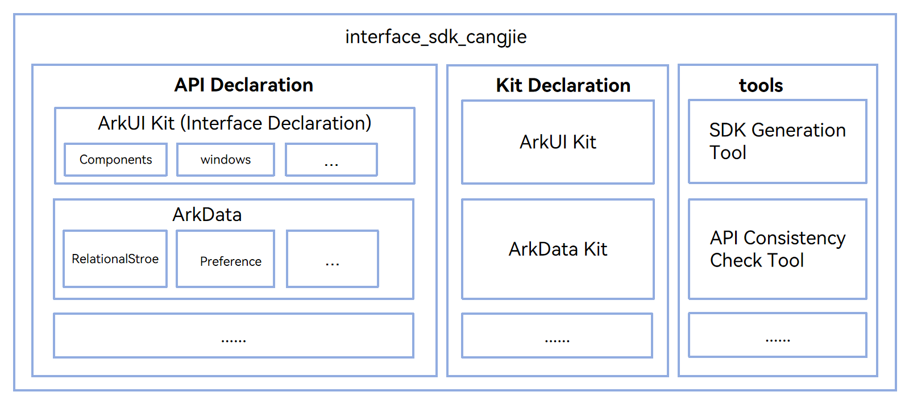
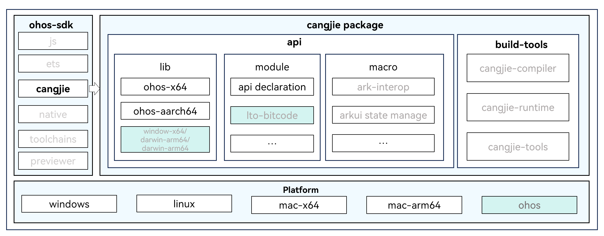

# Cangjie API Public Repository(beta feature)

## Introduction

The Cangjie API Public Repository is used to store and manage the public API declarations of each Cangjie subsystem. It also provides corresponding SDK building tools to support the construction of Cangjie API in the OpenHarmony SDK.

Currently, the Cangjie API only supports standard devices.

## System Architecture

**Figure 1** System architecture of interface_sdk_cangjie



As shown in the architecture diagram:

- **API Declaration:** Cangjie ohos modules and Cangjie standard library related API declaration files.
- **Kit Declaration:** Unified external declaration files of Cangjie kit modules.
- **build-tools:** SDK building toolset, mainly including the following tools:
  - **cjo generation toolchain:** Mainly consists of three parts:
    - Textual description files of Cangjie interfaces: Contains metadata such as package interface information, type definitions, function declarations, etc. During SDK building, the flatc tool and FlatBuffers Schema files are used to serialize the textual description files of Cangjie interfaces into cjo files of each Cangjie API module.

      For detailed introduction to Cangjie cjo and the serialization and deserialization build process of Cangjie cjo and JSON, please refer to [Cangjie cjo](https://gitcode.com/Cangjie/cangjie_docs/blob/08234c9e52cd55a6f1a2521c65f39745fa6d64a3/docs/dev-guide/source_en/Appendix/cjo_artifacts.md) and [Cangjie cjo Serialization and Deserialization Guide](docs/cangjie_cjo_serialization_and_deserialization_guide.md).
    - FlatBuffers Schema files.
    - python/gn related build scripts.

  - **API mock library generation tool:** Contains an empty implementation ohos.mock module and related build scripts to support building SDK to generate empty implementation dynamic library objects for each Cangjie API module.

Dependencies introduction in the architecture diagram:

- cangjie_ark_interop: The macro package in Cangjie SDK depends on the Cangjie-ArkTS interoperability interface repository to build interoperability macros.
- arkui_cangjie_wrapper: The macro package in Cangjie SDK depends on the ArkUI development framework Cangjie interface repository to build state management macros.
- flatbuffers: A high memory-efficient cross-platform serialization library that provides the flatc tool to support the Cangjie SDK to build Cangjie cjo files.

Code directory structure:
```
interface/sdk_cangjie
├── api
│   └── xxxKit                   # Specific Kit name, such as Cangjie, BasicServiceKit, etc.
│       └── xxx.cj.d             # Specific module interface files of each kit, storage path is subject to the actual file list of the kit
├── kits                         # Unified external declaration files of each kit
│   └── xxx.cj.d
├── build-tools                  # SDK building tools
│   ├── cjo                      # Tools related to cjo building
│   ├── lib
│   │   └── mock                 # Scripts related to mock API library                      
│   └── script                   # Scripts related to SDK building
├── figures                      # README images
├── docs
├── LICENSE
└── bundle.json
```

## Delivery View

**Figure 2** Cangjie SDK delivery view


**ohos-sdk:**

- OpenHarmony SDK consists of js, ets, native, toolchains, previewer, and cangjie components. This repository mainly involves the cangjie part.

**api:**

- The lib package currently only supports ohos-related build toolchains, storing Cangjie API dynamic libraries and Cangjie cjo files.
  - ohos-aarch64-libs: For building ohos-aarch64 application dependency libraries.
  - ohos-x86_64-libs: For building ohos-x86_64 application dependency libraries, mainly provided for ohos x86_64 simulator use.

- The api module package stores Cangjie API external declaration files and lto bitcode files.
  - Cangjie API external declaration files are copied from the api and kit directories of this repository and packaged into the Cangjie SDK.
  - lto bitcode products are under planning and not supported yet.

- The api macro package mainly stores Cangjie macro-related dynamic libraries and cjo files.
  
  For detailed introduction to Cangjie macros, please refer to [Cangjie Macro Introduction](https://gitcode.com/openharmony-sig/arkcompiler_cangjie_ark_interop/blob/master/doc/User_Manual/source_en/Macro/macro_introduction.md)

  - ark-interop: Cangjie interoperability macro dynamic libraries and cjo files of the cangjie_ark_interop component.
  - arkui state manager: Cangjie state management macro dynamic libraries and cjo files of the arkui_cangjie_wrapper component.

**build-tools:**

- Mainly stores Cangjie build toolchain, including Cangjie compiler, standard library, runtime library, tools, etc. The Cangjie build toolchain of the corresponding platform archived during the pre-download stage is copied and packaged into the Cangjie SDK.
  - cangjie-compiler: Includes cjc, cjc-frontend, etc.
  - cangjie-runtime: Mainly includes Cangjie runtime and Cangjie standard library dynamic libraries and Cangjie standard library API external declaration files.
  - cangjie-tools: Mainly includes cjpm, cjdb, cjfmt, etc.

Cangjie SDK package directory structure:
```
cangjie
├── api                                     # API symbol library
│   ├── lib                                 # Cangjie API dynamic libraries and corresponding cjo
│   │   ├── linux_ohos_aarch64_cjnative     
│   │   │   ├── kit
│   │   │   │   ├── xxx.so
│   │   │   │   └── xxx.cjo
│   │   │   └── ohos
│   │   │       ├── xxx.so
│   │   │       └── xxx.cjo
│   │   └── linux_ohos_x86_64_cjnative
│   │       ├── kit
│   │       │   ├── xxx.so
│   │       │   └── xxx.cjo
│   │       └── ohos
│   │           ├── xxx.so
│   │           └── xxx.cjo
│   ├── macro                               # Cangjie API macro libraries and corresponding cjo
│   │   └── ohos
│   │       ├── xxx.dll/xxx.so/xxx.dylib
│   │       └── xxx.cjo
│   └── modules                             # Cangjie API external declaration files
│       └── linux_ohos_aarch64_cjnative
│           ├── kit
│           │   └── kit.xxx.cj.d
│           └── ohos
│               └── ohos.xxx.cj.d
├── build-tools                             # Cangjie build toolchain
│   ├── bin                                 # Cangjie compiler binary directory
│   ├── lib                                 # Cangjie standard library static library storage directory
│   ├── modules                             # Cangjie standard library header files and cjo storage directory
│   ├── runtime                             # Cangjie runtime dynamic library storage directory (including Cangjie runtime library and Cangjie standard library)                                              
│   ├── third_party                         # Third-party libraries and tools that Cangjie depends on (mingw and llvm tools)
│   └── tools                               # Cangjie tools
└── oh-uni-package.json
```

## Build

```
./build.sh --product-name ohos-sdk --ccache  --build-target out/sdk/gen/build/ohos/sdk:cangjie   
```

For detailed Cangjie SDK integrated build instructions, please refer to [Cangjie SDK Integrated Build Guide](docs/cangjie_sdk_build_guide.md).

## Constraints

- Currently, Cangjie in ohos-sdk supports cross-compilation of ohos applications on windows/linux/mac-x64/mac-arm64 platforms, but does not support building applications on ohos platform.

## Code Contribution

Developers are welcome to contribute code, documentation, etc. For specific contribution processes and methods, please refer to [Code Contribution](https://gitcode.com/openharmony/docs/blob/master/en/contribute/code-contribution.md).

## Related Repositories

[arkcompiler_cangjie_ark_interop](https://gitcode.com/openharmony-sig/arkcompiler_cangjie_ark_interop/)

[arkui_arkui_cangjie_wrapper](https://gitcode.com/openharmony-sig/arkui_arkui_cangjie_wrapper/)

[third_party_flatbuffers](https://gitcode.com/openharmony/third_party_flatbuffers/)

[interface_sdk_c](https://gitcode.com/openharmony/interface_sdk_c/)

[interface_sdk-js](https://gitcode.com/openharmony/interface_sdk-js/)