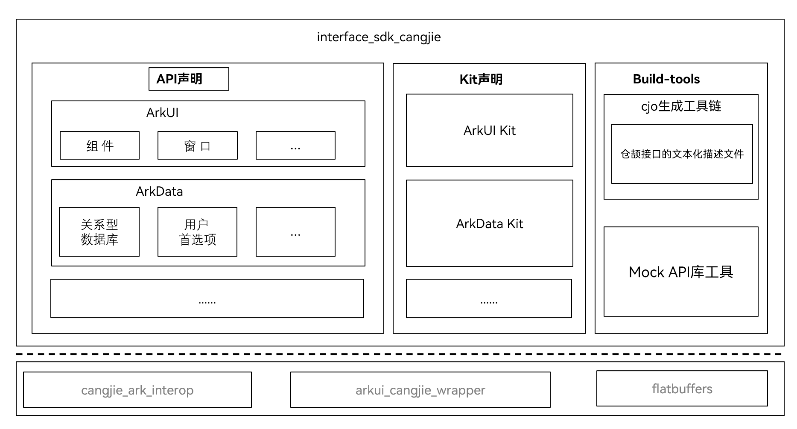

# 仓颉API公共仓

## 简介

仓颉API公共仓，用于存放和管理仓颉各个子系统对外声明API声明，同时提供对应的SDK构建工具，支撑Openharmony SDK中的仓颉API构建。

当前仓颉接口仅支持standard设备。

## 系统架构

**图 1** 元能力仓颉架构图



## 目录

```
├── api
│   └── xxxKit                   # Kit 具体名字，比如Cangjie, BasicServiceKit等
│       └── xxx.cj.d             # 各kit具体的接口文件，存放路径以kit实际文件列表为准
├── build-tools                  # sdk 构建工具
└── kits
    └── kit.xxx.cj.d             # 各kit对外统一声明文件
```

## 参与贡献

欢迎广大开发者代码，文档等，具体的贡献流程和方式请参见[参与贡献](https://gitcode.com/openharmony/docs/blob/master/zh-cn/contribute/%E5%8F%82%E4%B8%8E%E8%B4%A1%E7%8C%AE.md)。

## 相关仓

[cangjie_ark_interop](https://gitcode.com/openharmony/interface_sdk_cangjie)