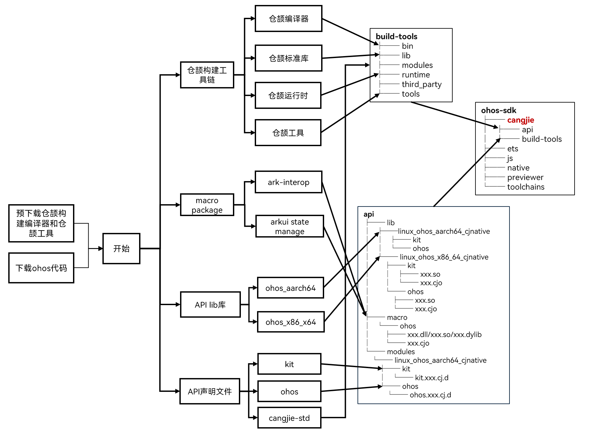

# 仓颉SDK构建说明

**图 1** 仓颉SDK构建示意图



## 仓颉构建工具链

- **构建仓颉构建工具链整体流程：**

  1. 仓颉编译器、仓颉工具预构建后，归档到OpenHarmony华为云仓库([cangjie_sdk](https://repo.huaweicloud.com/harmonyos/compiler/cangjie/))。仓颉运行时、仓颉标准库在构建SDK时由源码构建。
  2. 在预下载阶段，通过`bash build/prebuilts_download.sh`从华为云下载对应版本和平台的仓颉编译器、仓颉工具，并解压到`ohos/prebuilts/cangjie_sdk`目录下。
  3. 构建ohos-sdk仓颉包时，首先会直接从prebuilts/cangjie_sdk拷贝并压缩对应平台的仓颉编译器、仓颉工具到SDK中，其次再利用仓颉编译器从源码构建仓颉运行时和仓颉标准库，将其构建产物打包到SDK中（注意：当前仓颉运行时库还是采用预构建方式，构建SDK时采用直接拷贝预下载的运行库二进制）。

- **仓颉编译器预构建指导：** 请参考[仓颉编程语言编译器仓](https://gitcode.com/openharmony-sig/third_party_cangjie_compiler#%E7%BC%96%E8%AF%91%E6%9E%84%E5%BB%BA)中的编译构建相关章节。

- **仓颉工具预构建指导：** 请参考[仓颉语言命令行工具链仓](https://gitcode.com/openharmony-sig/third_party_cangjie_tools)中的编译构建相关章节。

## 仓颉运行时库构建指导

仓颉运行时库（包括仓颉标准库）可分为两类：部署在开发侧和部署在端侧的运行时库。

- 部署在开发侧是指可以运行在Linux/Windows/macOS平台上的运行时库，主要包括：  
  - windows_x86_64_cjnative
  - linux_x86_64_cjnative
  - darwin_x64_cjnative
  - darwin_aarch64_cjnative

- 部署在端侧是指下沉到OHOS镜像中的运行时库，包括：
  - linux_ohos_aarch64_cjnative
  - linux_ohos_x86_64_cjnative
  - linux_ohos_arm_cjnative

目前仓颉SDK开发侧和部署侧的运行时库都是采用预构建方式，后续会修改成对于部署在开发侧的运行时库采用预构建方式，对于部署在端侧的采用源码构建。

- 部署在**开发侧**的仓颉运行时库预构建指导请参考[仓颉运行时与仓颉编程语言标准库仓](https://gitcode.com/openharmony-sig/third_party_cangjie_runtime)中的编译构建章节。
  
- (TODO)部署在**端侧**的仓颉运行时库源码构建：

```bash
# 仓颉标准库
./build.sh --product-name ohos-sdk --ccache  --build-target third_party/cangjie_runtime/std:cangjie_std_package

# 仓颉运行时
./build.sh --product-name ohos-sdk --ccache  --build-target third_party/cangjie_runtime/std:cangjie_runtime_package   
```

## 仓颉宏库

仓颉宏库由arkui_cangjie_wrapper部件和cangjie_ark_interop部件构建生成，并拷贝到SDK中。


```bash
#  ohos.ark_interop_macro
./build.sh --product-name ohos-sdk --ccache  --build-target arkcompiler/cangjie_ark_interop/ohos:ohos.ark_interop_macro   

# ohos.arkui.state_macro_manage
./build.sh --product-name ohos-sdk --ccache  --build-target foundation/arkui/arkui_cangjie_wrapper/ohos/arkui/state_macro_manage:ohos.arkui.state_macro_manage   
```

## 仓颉API库

仓颉API库目录主要存放不同平台的仓颉API动态库，以及仓颉cjo产物。

- **仓颉API动态库**

    构建SDK时，通过API Mock工具生成空实现的so。

    ```bash
    ./build.sh --product-name ohos-sdk --ccache  --build-target interface/sdk_cangjie:ohos_aarch64_libs --build-target interface/sdk_cangjie:ohos_x86_64_libs
    ```

- **仓颉cjo产物**

    1. 开发者在新增或者修改已有仓颉API对外声明时，需要同步新增或修改interface_sdk_cangjie仓中对应模块的cjo.json文件。
    2. 仓颉接口的文本化描述文件为仓颉API对应模块构建后的cjo产物通过flatc工具反序列化生成，具体操作可以参考[仓颉cjo序列化和反序列化指导](../docs/cangjie_cjo_serialization_and_deserialization_guide.md)。

    ```bash
    ./build.sh --product-name ohos-sdk --ccache  --build-target interface/sdk_cangjie:ohos_aarch64_libs --build-target interface/sdk_cangjie:ohos_x86_64_libs
    ```

## 仓颉API对外声明文件

1. 开发者新增或者修改已有仓颉API对外声明时，需要同步修改interface_sdk_cangjie中api和kit下对应的声明文件。
2. SDK构建时会直接拷贝interface_sdk_cangjie仓中api和kit目录下头文件打包到SDK中仓颉对应的目录。

```bash
./build.sh --product-name ohos-sdk --ccache  --build-target interface/sdk_cangjie:sdk_header_ohos_aarch64
```